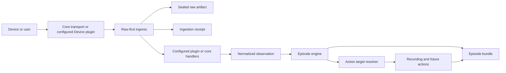

# Architecture

Episode is a local-first incident capture system. Core transports receive and
preserve opaque deliveries; configured plugins can interpret them into a small
vendor-neutral domain. Neither layer decides how incidents are correlated or
which actions run.

## Processing flow



Raw bytes and their receipt are committed before a handler receives an
immutable ingress envelope. That envelope includes the receipt and artifact
identities, bounded payload bytes, byte length, SHA-256, seal state, and
transport metadata. A malformed, unknown, ignored, or failed delivery therefore
still has a durable receipt and artifact record.

Handler selection is explicit. The core normalized Event contract is registered
only when its Event API transport is configured. Installed files do not activate
plugins, handler execution has a timeout, failures are isolated, and conflicting
claims are rejected instead of being resolved by registration order.

## Domain language

| Concept | Responsibility | Mutability |
| --- | --- | --- |
| Area | Physical coverage and correlation boundary | Configuration evolves |
| Device | Physical source role: camera, doorbell, alarm panel, sensor, or other | Discovery metadata evolves |
| Raw Artifact | Exact bytes received or generated | Content is sealed and checksummed |
| Ingestion Receipt | One delivery through one connector | Associations may be added |
| Event | Canonical observation deduplicated across receipts | Core observation is stable |
| Evidence | Snapshot, recording, or other incident material | Original bytes are stable |
| Episode | Correlated interpretation of related activity | Evolves until closed |
| Annotation | Derived interpretation from a processing run | Append-only; planned |
| Action Run | One policy-triggered operation and its result | Append-only; planned |

An Event is not a connector message. ONVIF, ISAPI, and Alarm Server can each
create a receipt for the same camera observation while sharing one canonical
Event. Complementary observations, such as broad ONVIF motion followed by a
vendor human classification, remain distinct Events in the same Episode. ONVIF
is the primary standards-based path; vendor connectors add detail.

State transitions also have lifecycle meaning. Every active Event contributes a
minimum deadline using the triggering Device's activity window. The Episode
persists the greatest contributed deadline, so later Events may extend it but
cannot shorten it, and configuration edits or restarts cannot change a decision
already made. Recording Devices that joined through Area policy follow the
Episode; they do not impose their own window unless they also emit an Event.

An inactive Event is paired with the latest preceding active Event from the same
Area, Device, and normalized Event type. It inherits that Event's Episode even
when the Episode has already closed, but does not shorten its persisted minimum
deadline, reopen it, or restart actions. Unpaired inactive Events remain
preserved and unassigned. This lifecycle policy belongs to correlation, not to
protocol plugins.

## Current module boundaries

```text
src/episode/
├── connectors/       shared ingress transports
├── ingestion/        raw-first preservation and bounded plugin dispatch
├── plugins/          lazy integrations and protocol/vendor interpretation
│   ├── onvif/        standards-based Device integration
│   └── hikvision/    import-empty vendor namespace and shared XML helpers
│       ├── alarm_server/
│       ├── ftp/
│       ├── isapi/
│       └── sdk/
├── media/            camera media registry and timelapse service
├── actions/          vendor-neutral snapshot action
├── domain/           vendor-neutral models and identities
├── engine/           correlation and lifecycle orchestration
├── inventory/        persistent Device/Area configuration service and validation
├── plugin_api/       versioned public contract for out-of-tree plugins
├── recording/        vendor-neutral recording action
├── storage/          SQLite, immutable files, provenance, bundle projection
├── retention.py      visual Evidence lifecycle and expiration tombstones
├── api/              public HTTP representation
└── ui/               static Episode-first web interface
```

Dependencies point inward: transports, plugins, storage, actions, API, and UI
may depend on domain concepts. The domain must not depend on Hikvision, FastAPI,
SQLite, or FFmpeg. Shared transports must not import vendor parsers.

The shared-ingress implementations now cover two transport shapes. The core
HTTP transport preserves the complete Alarm Server request body, while the
configured Hikvision handler extracts `EventNotificationAlert` and emits a
normalized observation. The core FTP transport preserves each uploaded file;
the Hikvision FTP handler recognizes supported filenames and emits snapshot
Evidence. Unknown files remain visible raw deliveries. HCNetSDK callbacks
follow the same raw-first route; native decoding remains isolated in the SDK
plugin.

The optional Event API is the vendor-neutral exception to plugin interpretation:
its JSON schema is already a canonical observation contract, so a core-owned
handler validates it after raw preservation. The referenced Device's stored Area
is authoritative. Unknown or disabled Devices remain unmatched receipts, and
producer identifiers provide idempotency without bypassing canonicalization.

ISAPI stream ownership, Digest authentication, idle-stream detection, reconnect
behavior, bounded stream decoding, ignored-Event policy, and XML interpretation
live in its lazily activated Device plugin. A 60-second byte-level watchdog
breaks half-open connections and exposes stream activity and reconnect counters
through plugin diagnostics. ONVIF discovery, media registration, validation,
snapshot endpoints, pull-point subscriptions, and notification interpretation
follow the same lifecycle. Complete SOAP pull responses are preserved before
derived notifications are interpreted. The application core sees only generic
plugin services, raw deliveries, media registrations, inventory updates, and
normalized observations.

The plugin context exposes narrow typed services rather than concrete core
implementations. Registration metadata is the authoritative catalog for a
plugin's operational name, integration type, activation configuration, validation,
scope, and advertised capabilities. API and inventory projections consume that
catalog instead of maintaining vendor-specific maps. Public plugin status is
validated as JSON-safe data; a broken status implementation degrades only that
plugin.

Third-party plugins use the separate, versioned `episode.plugin_api` facade.
Direct children of the mounted plugin directory may declare an
`episode-plugin.json`; manifests are inspected without importing their code and
only explicit top-level plugin configuration activates an entrypoint. The
adapter scopes Device configuration to declared Device IDs, namespaces ingress
handlers, supplies authoritative Area identity, and translates public
observations back into the core raw-first pipeline. Built-in integrations retain
their internal contract while plugin API v1 remains supported throughout beta.

Plugin API version 1 supports Device and ingress plugins. Action and processor
kinds are reserved, not implemented. Third-party Python executes in the Episode
process and is trusted rather than sandboxed; ordinary lifecycle and handler
failures are isolated, while native integrations should use supervised workers
when process-level crash containment matters.

External-plugin directories and entrypoints must resolve inside the mounted
plugin root. Factory and partial-startup failures release namespaced ingress and
media registrations. Public status projection rejects unsupported values and
redacts common secret field names; because plugins are trusted code, this only
prevents accidental disclosure and is not a sandbox.

Runtime resources are entered through one application lifecycle and released in
reverse order. Shared transports stop accepting deliveries before plugin
handlers, actions, the Episode engine, and storage are stopped. A failure in one
cleanup is logged without preventing the remaining resources from closing.
Asynchronous plugin startup and shutdown are bounded independently, so a hung
plugin cannot indefinitely block later integrations or application cleanup.

At startup, the Episode engine closes persisted active Episodes whose minimum
deadline has passed. After plugins restore media registrations, the recording
engine reconstructs targets for Episodes whose deadline remains in the future.
An interrupted HLS recording resumes in its existing Evidence workspace with an
explicit playlist discontinuity; it does not create a second logical recording.


## Persistence model

SQLite is the operational index. It makes filtering and correlation efficient,
but it is not the only way to understand an incident.

SQLite runs in write-ahead-log (WAL) mode so API and engine reads can continue
while connectors commit raw deliveries. Both connections use a bounded busy
timeout for brief writer contention. The main operational connection enforces
the canonical schema's foreign keys; the raw-delivery connection persists its
receipt before the normalized Event or Evidence exists and links it afterwards.
Raw-delivery transactions are serialized and always rolled back when interrupted,
including task cancellation, so an abandoned connector task cannot retain the
database write lock.

The storage layer keeps one stable repository façade for application callers,
while inventory, canonical Event, and provenance SQL live in focused stores.
Raw Artifacts describe immutable content; Receipts exclusively describe how,
when, and from where that content arrived.

Startup recovery also derives each Episode's Event and Evidence counters from
the canonical rows before rebuilding portable manifests. Interrupted or older
write paths therefore cannot leave collection summaries permanently stale.

Area and Device inventory is persistent configuration stored in SQLite and
managed through the UI. `episode.json` remains responsible only for system-wide
services and action defaults. Disabling inventory preserves historical
relationships, and referenced records cannot be deleted. Device type expresses
physical role, never vendor. Vendor identity is discovered when possible, while
optional vendor integrations remain separate configurations. A Device's
`configs` determine which integrations are enabled; `capabilities` describe
what the Device has actually advertised or demonstrated. Saving or deleting a
Device immediately reloads the running plugin set from the authoritative
inventory. Existing recording processes remain owned by the
recording engine and continue until their Episode closes; newly added Devices
participate in later qualifying Events.

The additive tables include:

- `areas` and `devices`: authoritative inventory, capability configuration,
  credentials, and active state.
- `raw_artifacts`: location, media type, byte length, SHA-256, and seal state.
- `ingestion_receipts`: source, timing, parse status, and links to artifacts,
  Events, Evidence, and Episodes.
- `events`: canonical observations with a stable deduplication key.
- `evidence`: incident material with artifact and integrity references.
- `episodes`: lifecycle and summary index.
- `system_settings`: UI-managed installation policy such as visual retention.
- `evidence_expirations`: intentional Evidence tombstones after retained bytes
  are removed.

During the pre-release lifecycle, Episode supports only the current database
schema. Schema migration guarantees begin when the stable storage contract is
declared; until then, a development release may require a clean database.

## Episode bundles

Every correlated incident is portable as a directory:

```text
data/episodes/<episode-id>/
├── manifest.json
├── journal.ndjson
├── events/
├── snapshots/
├── recordings/
│   └── <evidence-id>/
│       ├── index.m3u8
│       ├── init.mp4
│       ├── manifest.json
│       └── segments/
│           └── segment-000000.m4s
├── other/
└── timelapses/
```

`manifest.json` is an atomic, rebuildable index containing the Episode, safe
area and device identity, canonical Events, receipts, Evidence, relative file
paths, byte lengths, and SHA-256 checksums.

`journal.ndjson` is append-only history for important bundle changes. A copied
Episode directory therefore retains its relationships even when `episode.db` is
unavailable.

The manifest and journal are derived metadata. They may evolve; original
artifact bytes are never annotated or rendered with overlays.

The Episode review timeline is also a derived projection. Vendor bounding boxes
remain Event metadata and are rendered as a separate overlay. For review only,
consecutive target snapshots can extend a short-lived detection track and later
annotated Events can update its region. A gap or explicit inactive Event closes
the track. This inference is not written back to Events, Evidence, manifests, or
raw artifacts.

Collection views use fixed-profile JPEG thumbnails generated from immutable
Evidence on demand. These files live only below `data/cache/thumbnails`, are
keyed by Evidence checksum—or stable Evidence ID when a legacy row has no
checksum—and presentation profile. They can be discarded and regenerated at
any time. The thumbnail cache has no storage
repository dependency and cannot mutate or delete Evidence, Raw Artifacts,
receipts, manifests, journals, or Episode bundle contents.

Each participating camera creates one logical recording Evidence item for the
Episode. Its filesystem bundle contains an event-style HLS playlist, fMP4
initialization data, small immutable media fragments, and a dedicated atomic
component manifest. The component manifest inventories every fragment with its
sequence, observed timestamp and duration when available, byte length, and
SHA-256 checksum. Individual fragments are implementation components: they do
not become Evidence rows or UI cards.

The workspace exists while capture is active, but the Evidence row is published
only after finalization. On shutdown Episode signals all active FFmpeg processes
before awaiting them, preserving each workspace for recovery. A restart resumes
the same bundle with a playlist discontinuity when its Episode is still active;
otherwise it finalizes the bundle. Legacy `.mp4.part` files retain their
compatibility recovery path.

The recording action copies the camera video bitstream and transcodes audio to
AAC when present; it does not silently transcode video Evidence for browser
compatibility. The UI uses native HLS first and a pinned, integrity-checked
hls.js CDN fallback. H.264 is broadly playable, while HEVC playback remains
dependent on browser and operating-system decoder support. Future compatibility
proxies or transcodes must be separate derived presentation artifacts.

One global visual Evidence retention policy defaults to an active but
unconfirmed 30-day period and is managed from the System UI. An administrator
must explicitly confirm the default, select another period, or disable automatic
deletion. Disabled retention remains persistently visible in the UI. Startup and
hourly cleanup remove complete expired recording bundles, snapshots, embedded pictures, thumbnails,
timelapses, and other Episode-managed visual copies. The canonical Evidence row,
Raw Artifact, and portable manifest retain identity and integrity metadata while
removing recoverable file paths. Files currently being written are deferred until
a later cleanup, and failures degrade System status for operator action.

Evidence correlation uses the source observation timestamp and Area. Delayed
uploads can therefore join an already-closed Episode when they were captured
inside its recorded lifespan; this updates provenance and the portable bundle
without reopening the Episode or restarting actions. If no lifespan contains
the timestamp, an active same-Area Episode remains the fallback for small clock
differences between independent sources.

## Canonical event identity

The first implementation derives a key from:

```text
device id + observed timestamp + normalized event type + event state
```

This intentionally handles duplicate ISAPI and Alarm Server deliveries from the
same configured device. The Event API can provide a stronger producer identifier.
It scopes an external identifier by producer and Device, stores it on every
receipt, and derives the canonical key without changing the Event representation.

## Integrity and immutability

- Incoming raw deliveries and completed Evidence are SHA-256 hashed.
- Write permissions are removed when the filesystem supports it.
- File moves are collision-safe and never intentionally overwrite evidence.
- Episode association is committed before files are relocated, making an
  interrupted operation recoverable.
- Startup reconciles database paths, receipt links, and checksum-identical files
  already moved into Episode folders, then rebuilds manifests.
- Public APIs expose checksums and provenance, not internal absolute paths.
- Overlays and future AI output belong in annotations or derived artifacts.

This is tamper-evident local storage, not a cryptographic chain of custody.
Signed manifests and external timestamping are possible future extensions.

## Extension rules

New shared transports should submit opaque deliveries to `IngestionService`.
Device and ingress-handler plugins register narrow matchers and return a
normalized observation only after the durable boundary. Device integrations own
their protocol clients, discovery, connection supervision, validation, and
interpretation; the application must not construct protocol-specific
connectors.

Device integrations may suppress repeated transport-level status heartbeats
before submission when the integration is explicitly configured to ignore that
Event type. The first observed state and every transition are still preserved;
non-ignored Events always cross the raw-first boundary unchanged.

New actions should consume canonical domain messages or target-resolution
decisions. They must not subscribe directly to vendor-specific connector
payloads. Recording targets are currently resolved from the Event source and
Area; this boundary can accept future target strategies without changing
connectors or recording execution.

The UI's active-Episode current views are operational views of the HLS recording
already being captured, with short-lived snapshot previews as a startup
fallback. They are limited to Devices actively recording that Episode and never
expose camera credentials. A missing current view does not affect recording
health.

New AI, OCR, LPR, or recognition integrations should create versioned processing
runs and append annotations. Reprocessing must never replace prior results or
modify source evidence.

## Operational API projection

The API owns the stable operational representation consumed by the UI. It
projects internal connector and plugin state into vendor-neutral Services,
Integrations, Device identity, Device capabilities, and capture policy.
Connector dictionaries and plugin lifecycle objects are diagnostics inputs;
they are not UI contracts.

`/health` remains a minimal liveness response. `/api/v1/status` is the compact,
frequently-polled summary and deliberately excludes connector discovery data.
`/api/v1/diagnostics` provides richer normalized detail for the System view,
including a bounded credential-free projection of active recording progress
and recent persisted incomplete captures. The recorder treats a lack of new HLS
fragments as a stalled stream after a conservative internal window, restarts
FFmpeg, and exposes the recovery state without leaking its RTSP URL.
Device collection responses are compact; Device detail adds safe network,
policy, media-profile, and integration information without exposing credentials
or internal configuration structures.

Growing top-level collections have validated limits and offsets. Area and
Device mutation routes enforce referential safety, duplicate-address checks,
write-only credentials, and active-Area constraints. Integration support,
configured selection, and runtime health are separate states: safe validation
probes provide evidence without activating connectors, and transient failures
are never presented as proof of unsupported hardware. Device changes are durable
immediately and reconcile the running Device integrations before the mutation
request completes. Recording processes already in progress remain independent
of that integration lifecycle.

Receipt collection queries support deterministic offset pagination and filters
for source, outcome status, Episode, Event, and Evidence. A single-receipt route
provides direct traceability, while artifact bytes remain on the separate
artifact download route. Transport and concise outcome reason are projected as
first-class fields without removing the underlying diagnostic metadata.

## Known constraints

- Correlation is restricted to time-proximate Events within the same Area.
- The generic Event API is a trusted-LAN input, not an authenticated public webhook.
- `on_event` video devices record their own active Events; `on_episode` video
  devices record active Episodes in their Area, including Episodes opened by
  non-video sources.
- Episode minimum duration is contributed by triggering Devices; later active
  Events may extend it but no Event can shorten it.
- Recording lifetime follows Episode lifetime; ONVIF snapshot capture is
  explicit and disabled by default.
- Broader event-to-action policy is not implemented.
- Authentication and safe Internet exposure are not implemented.
- Annotation and processing-run persistence are planned, not yet public APIs.
- Capture resumes after an application or host restart only while the persisted
  Episode remains active and its recording target can be reconstructed. A
  restart may still create a capture gap or leave an unfinished fragment; these
  conditions remain explicit instead of being presented as continuous media.

These are the next boundaries to extract; they are not reasons to expand
connector-specific logic into the core.
